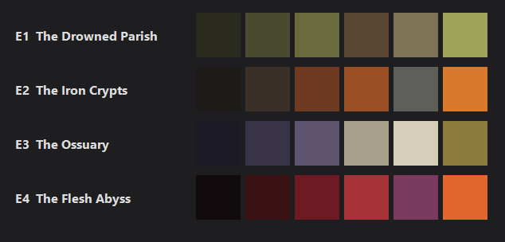

# Art Direction

> **Draft.** Episodes, names and palettes are a starting point and change when
> the game needs it. Every texture, model and effect should still follow the
> rules below, so assets from different sources look like one game.

## Mood

Abomination is dark, filthy and frightening, in the spirit of Quake: gothic
stone, rot, rust, blood and things that should not exist. Nothing is new or
clean. Each episode has its own places, colors and color grading, but all four
share this mood.

The four episodes lead from a world that is still almost human into one that
is not at all.

## Episodes



| Episode | Places | Mood | Palette |
|---------|--------|------|---------|
| **E1 · The Drowned Parish** | Swamp coast, flooded village, abbey, catacombs, bell tower | Rot, damp, fog, dim yellow-green light | `#2B2A1F` silt · `#4A4A2E` moss · `#6B6A3C` olive · `#5A4632` rotten wood · `#7D7458` wet stone · `#9FA35A` lichen |
| **E2 · The Iron Crypts** | Mines, foundries, prison, rail tunnels, a cathedral of pistons | Rust, soot, chains, the heat of furnaces, machines greased with blood | `#1E1A18` soot · `#3B2F2A` burnt earth · `#6E3B22` rust · `#9A4E24` light rust · `#5E5E5A` iron · `#D9792B` embers |
| **E3 · The Ossuary** | A gothic cathedral city: bone ornaments, crypts, stained glass, ritual halls | Cold, grandeur, dead silence, tarnished gold | `#1C1A24` night · `#3A3448` shadow violet · `#5E5470` violet · `#A89F8A` old bone · `#D6CEB8` bone · `#8C7A3E` tarnished gold |
| **E4 · The Flesh Abyss** | Another world: living walls, veins, obsidian, lava, floating islands, the lair of the final boss | Disgust, pulsing, red and black | `#120B0D` obsidian · `#3A1216` dried blood · `#6E1A22` flesh · `#A8323A` raw flesh · `#7A3A5E` bruise · `#E0662E` lava |

Each episode has 5 levels and a boss. The same kind of surface (floor, wall,
crate) looks different in every episode: a rotten wooden crate in E1, an
iron-plated one in E2, and so on. A level uses several floors and walls, with
transitions between them (grass to a wooden bridge, the bridge to stone).

## Texture rules

- **Scale as in Quake:** 1 texel = 1 map unit (about 3 cm). Most textures are
  64 × 64 texels (a 2 × 2 m patch of wall); large details (gates, ornaments)
  128 × 128. Pixels stay crisp (`GL_NEAREST` filtering).
- **Size of objects is not the size of their texture.** The player is 56
  units tall; a usual crate is 32 units (1 m) with its 64 × 64 texture at
  scale 0.5, a 64-unit crate is a large container. Small objects may use
  scale 0.5 like this (2 texels per unit); walls and floors stay at scale 1.
- **Tileable:** a texture repeats on a wall without visible seams.
- **No painted light.** Real light and shadows come with lightmaps (0.5); light
  painted into a texture would fight them. Only slight darkening in crevices
  (between bricks, in cracks) is allowed.
- **Slightly muted colors,** taken from the palette of the episode. The mood of
  an episode is finished by its color grading (0.9); very bright textures
  would leave it no room.
- **Dirt everywhere:** cracks, stains, rust, chips, moss. Nothing new or clean.

## Folders and names

```
Assets/Textures/
├── Common/      Used in every episode: tool textures, metal details, buttons
├── Episode1/    Wall_MossyBrick, Floor_WetFlagstone, Floor_RottenPlanks, Crate_Rotten, …
├── Episode2/    Added when the levels of an episode are built
└── …
```

- Names are `Category_Description` in PascalCase (`Floor_WetFlagstone`), so
  floors, walls and crates stay together in the material browser of
  TrenchBroom.
- Every folder is one collection in TrenchBroom, which looks exactly one level
  deep: no subfolders inside an episode folder.
- A map refers to a texture by its path in `Assets/Textures` without the
  extension: `Episode1/Wall_MossyBrick`.
- Textures are made when a level needs them, not in advance.

## Where textures come from

- **Generated:** `Tools/TextureGenerator` draws textures with code (noise,
  brick and slab layouts, cracks) in the colors of an episode palette.
  `Generate.ps1` writes them into `Assets/Textures` and preview sheets (each
  texture enlarged and tiled 3 × 3) into `Build/TexturePreviews`. The seeds are
  fixed, so the same code always gives the same files.
- **Downloaded or made in other tools** (CC0 packs, AI image generators): any
  source is fine if the texture follows the rules above and is listed in
  [ASSETS.md](ASSETS.md) with its license.
