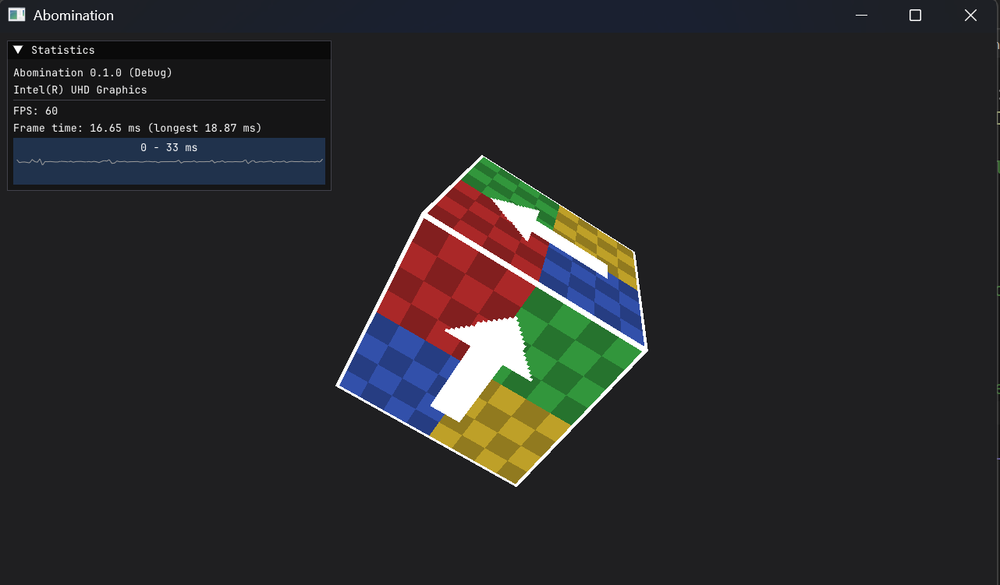

<div align="center">

<!-- Logo goes here once it is ready:

-->

# ABOMINATION

**A retro first-person shooter inspired by Quake (1996),<br>
built from scratch with modern C++ and OpenGL 4.6.**

[](https://en.cppreference.com/w/cpp/23)
[](https://www.khronos.org/opengl/)
[](https://www.libsdl.org/)

<br>
[](https://github.com/demianblogan/Abomination/actions/workflows/CI.yml)
[](https://github.com/demianblogan/Abomination/releases/latest)
[](Documentation/ROADMAP.md)
[](Documentation/ROADMAP.md)
[](LICENSE.md)

[About](#-about) •
[Features](#-features) •
[Screenshots](#-screenshots) •
[Tech Stack](#%EF%B8%8F-tech-stack) •
[Download](#%EF%B8%8F-download) •
[Building](#-building) •
[Controls](#-controls) •
[Roadmap](#%EF%B8%8F-roadmap) •
[Documentation](#-documentation) •
[License](#-license)

</div>

---

## 🩸 About

**Abomination** is a fast-paced, old-school shooter: no reloading, no
cutscenes, no hand-holding — just you, a growing arsenal and whatever crawls,
flies and teleports out of the dark.

The project is also a deep dive into graphics programming: the engine is
written from the ground up, and every system — from the OpenGL renderer to
the enemy AI — is built to be read and learned from.

> [!NOTE]
> The game is in early development. **Version 0.1** is out: a free-fly camera around a test
> cube — follow the [roadmap](Documentation/ROADMAP.md) to see what is being built next.

## 🎯 Features

<table>
<tr>
<td width="50%" valign="top">

### 🕹️ Gameplay
- **4 episodes × 5 levels**, a unique boss at the end of each episode
- **Quake-style movement** — fast, fluid, skill-based
- **Varied arsenal** — every weapon has its own model and feel
- **Diverse enemies** — they run, crawl, jump, fly, climb walls and teleport
- Doors, buttons, pressure plates, traps and secrets

</td>
<td width="50%" valign="top">

### 🎨 Presentation
- **Retro look** — low-poly models, low-resolution pixel-crisp textures
- **Modern lighting** — baked lightmaps, dynamic lights, HDR, bloom
- Unique color palette for every episode
- Full gamepad support, including **DualSense** haptics, adaptive triggers
  and light bar
- 5 languages: English, Español, Deutsch, Русский, Українська

</td>
</tr>
</table>

## 📸 Screenshots

<div align="center">



<sub><b>0.1 Foundation</b> — the first 3D image: a textured cube, a free-fly camera and the debug overlay</sub>

</div>

## 🛠️ Tech Stack

| Area            | Technology                                                                 |
|-----------------|----------------------------------------------------------------------------|
| Language        | C++23 (MSVC, `/W4 /WX`)                                                    |
| Graphics        | OpenGL 4.6 Core · Direct State Access · GLSL 4.60 · GLAD 2                 |
| Platform        | SDL3 — window, input, gamepads                                             |
| Architecture    | ECS with EnTT                                                              |
| Math            | glm                                                                        |
| Logging         | spdlog                                                                     |
| Debug tools     | Dear ImGui                                                                 |
| Levels          | TrenchBroom + own level compiler                                           |
| Build           | CMake · vcpkg · GitHub Actions                                             |
| Testing         | GoogleTest · CTest                                                         |

## ⬇️ Download

Every finished milestone is published as a ready-to-play build:
**[latest release](https://github.com/demianblogan/Abomination/releases/latest)**.
Unzip the archive anywhere and run `Abomination.exe` — nothing else to install.

Requires **Windows 10/11 (x64)** and a graphics card with **OpenGL 4.6**
support (any GPU from the last ten years with up-to-date drivers).

## 🔨 Building

Requires **Visual Studio 2026** (Desktop development with C++) and
**[vcpkg](https://github.com/microsoft/vcpkg)** with `VCPKG_ROOT` set.

```bash
git clone https://github.com/demianblogan/Abomination.git
```

Open the folder in Visual Studio — it picks up `CMakePresets.json`, vcpkg
fetches all libraries, and **F5** runs the game.
Full instructions, including the command line: **[BUILDING.md](Documentation/BUILDING.md)**.

## 🎮 Controls

The current build (milestone 0.2 in progress) has a free-fly camera in a test level made in TrenchBroom.

| Input | Action |
|:-----:|--------|
| <kbd>W</kbd> <kbd>A</kbd> <kbd>S</kbd> <kbd>D</kbd> | Fly forward, left, back, right (relative to the view) |
| <kbd>E</kbd> / <kbd>Q</kbd> | Fly up / down |
| <kbd>Shift</kbd> | Fly faster |
| Hold **right mouse button** | Look around with the mouse |
| <kbd>F1</kbd> | Show / hide the debug overlay |
| <kbd>Alt</kbd> + <kbd>Enter</kbd> | Switch between windowed and borderless |
| <kbd>Esc</kbd> | Quit the game |

## 🗺️ Roadmap

| Version | Milestone              | Status |
|:-------:|------------------------|:------:|
| 0.1     | Foundation             | ✅     |
| 0.2     | First Steps            | 🔨     |
| 0.3     | Boomstick              | ⏳     |
| 0.4     | It Moves               | ⏳     |
| 0.5     | Lights                 | ⏳     |
| 0.6     | Game Loop              | ⏳     |
| 0.7     | Arsenal & Bestiary     | ⏳     |
| 0.8     | Menus & Saves          | ⏳     |
| 0.9     | Content Complete       | ⏳     |
| **1.0** | **Release**            | ⏳     |

<sub>✅ done · 🔨 in progress · ⏳ planned — details in [ROADMAP.md](Documentation/ROADMAP.md)</sub>

## 📚 Documentation

| Document                                   | What's inside                                         |
|--------------------------------------------|-------------------------------------------------------|
| 🗺️ [Roadmap](Documentation/ROADMAP.md)               | Milestones from 0.1 to 1.0 and the current plan       |
| 🔨 [Building](Documentation/BUILDING.md)           | Requirements and build instructions                   |
| 🏛️ [Architecture](Documentation/ARCHITECTURE.md)     | Modules, dependency rules, main loop, renderer, ECS, world |
| ✍️ [Code Style](Documentation/CODE_STYLE.md)         | Naming, formatting and C++/GLSL conventions           |
| 🌿 [Git Conventions](Documentation/GIT_CONVENTIONS.md) | Branches, commits, pull requests, versions          |
| 🧱 [Level Editing](Documentation/LEVEL_EDITING.md)  | Setting up TrenchBroom and building maps              |
| 📦 [Assets](Documentation/ASSETS.md)                 | Third-party assets and their licenses                 |
| 🧩 [Third-Party](Documentation/THIRD_PARTY.md)     | Libraries and tools with their licenses               |

## 📜 License

The source code is licensed under the
**[PolyForm Noncommercial License 1.0.0](LICENSE.md)** — you are welcome to
read, study and modify it for any noncommercial purpose.
Third-party assets keep their own licenses, see [ASSETS.md](Documentation/ASSETS.md).

---

<div align="center">

Made with 🩸 by **Alone Bull**

</div>
